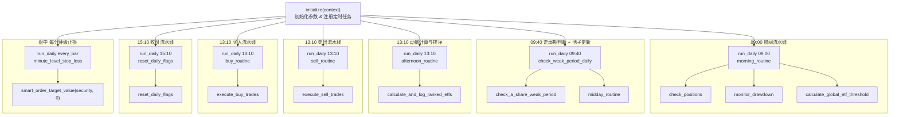
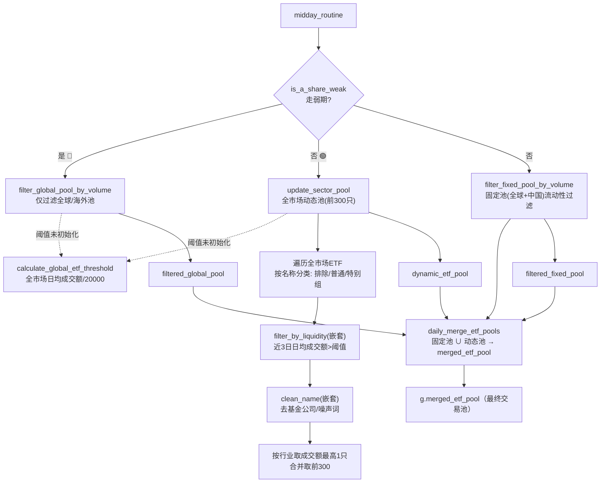
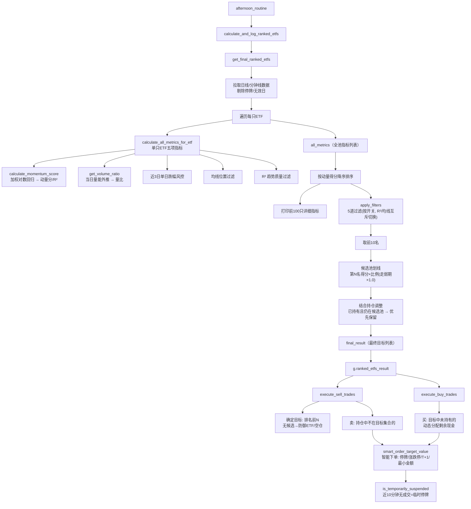
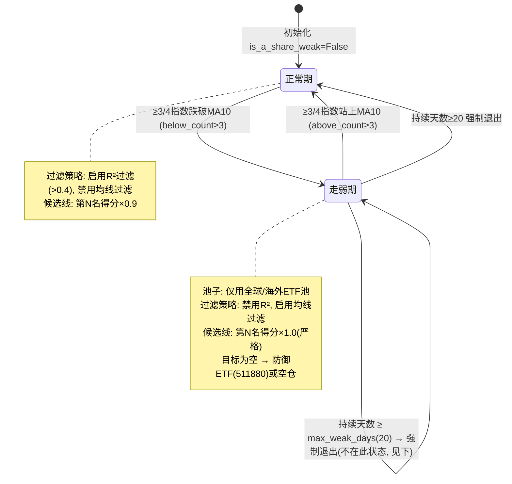
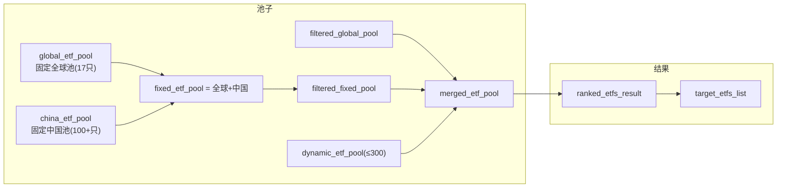

# 【五福闹新春】v5.2 函数调用关系图

来源: `joinquant/02-FiveHappy-v5.2.py`

## 1. 整体调度（initialize 中注册的定时任务）

## 2. 池子构建链路（09:40 早盘流水线）

## 3. 选股 + 调仓链路（13:10 午盘/卖出/买入）

## 4. 大盘走弱期状态机（check_a_share_weak_period）

## 5. 全局状态变量（g.xxx 数据流）

## 6. 函数清单

| 函数 | 行号 | 职责 | 被谁调用 |
|---|---|---|---|
| `initialize` | 12 | 参数/池子/定时任务初始化 | 聚宽入口 |
| `morning_routine` | 241 | 晨间: 持仓检查+回撤+阈值 | run_daily 09:00 |
| `check_weak_period_daily` | 236 | 走弱期判断+池更新 | run_daily 09:40 |
| `midday_routine` | 253 | 池子构建总调度 | check_weak_period_daily |
| `afternoon_routine` | 272 | 午盘: 动量计算 | run_daily 13:10 |
| `sell_routine` | 287 | 卖出流水线 | run_daily 13:10 |
| `buy_routine` | 292 | 买入流水线 | run_daily 13:10 |
| `reset_daily_flags` | 298 | 清缓存 | run_daily 15:10 |
| `check_positions` | 304 | 打印持仓状态 | morning_routine |
| `monitor_drawdown` | 315 | 回撤监控记录 | morning_routine |
| `calculate_global_etf_threshold` | 346 | 全市场流动性阈值 | morning_routine / filter_* |
| `filter_global_pool_by_volume` | 381 | 全球池流动性过滤 | midday_routine(走弱期) |
| `update_sector_pool` | 423 | 动态池构建(分类+行业) | midday_routine(正常期) |
| `filter_fixed_pool_by_volume` | 626 | 固定池流动性过滤 | midday_routine(正常期) |
| `daily_merge_etf_pools` | 667 | 合并池 | midday_routine(正常期) |
| `calculate_and_log_ranked_etfs` | 677 | 动量计算入口 | afternoon_routine |
| `calculate_momentum_score` | 686 | 加权对数回归打分 | calculate_all_metrics_for_etf |
| `calculate_all_metrics_for_etf` | 713 | 单ETF五项指标 | get_final_ranked_etfs |
| `get_volume_ratio` | 765 | 当日量能外推量比 | calculate_all_metrics_for_etf |
| `check_a_share_weak_period` | 788 | 走弱期状态机 | check_weak_period_daily |
| `apply_filters` | 863 | 5道条件过滤 | get_final_ranked_etfs |
| `get_final_ranked_etfs` | 878 | 选股主流程(4步) | calculate_and_log_ranked_etfs |
| `execute_sell_trades` | 1031 | 卖出执行 | sell_routine |
| `execute_buy_trades` | 1067 | 买入执行 | buy_routine |
| `is_temporarily_suspended` | 1115 | 临时停牌检测 | smart_order / 选股 |
| `smart_order_target_value` | 1143 | 智能下单(风控6道) | 卖出/买入/止损 |
| `minute_level_stop_loss` | 1216 | 分钟级固定止损 | run_daily every_bar |
| `get_security_name` | 1240 | 名称解析 | 各处 |
| `check_defensive_etf_available` | 1249 | 防御ETF可用性 | execute_sell_trades |
| `trade` | 1264 | 空实现 | 未使用 |

## 7. 关键设计点

1. **时间线**：09:00 阈值 → 09:40 池子 → 13:10 计算+卖+买 → 15:10 重置，每分钟止损
2. **弱市切换**：走弱期只用全球池、R²过滤换均线过滤、候选线严格化、可切防御ETF
3. **低换手**：已持有且在候选池的 ETF 优先保留，避免每天来回切换
4. **下单风控**：全天停牌/临时停牌/涨跌停/T+1/最小金额 6 道检查
